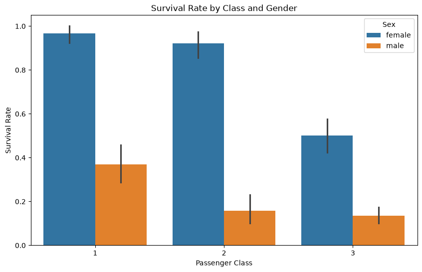
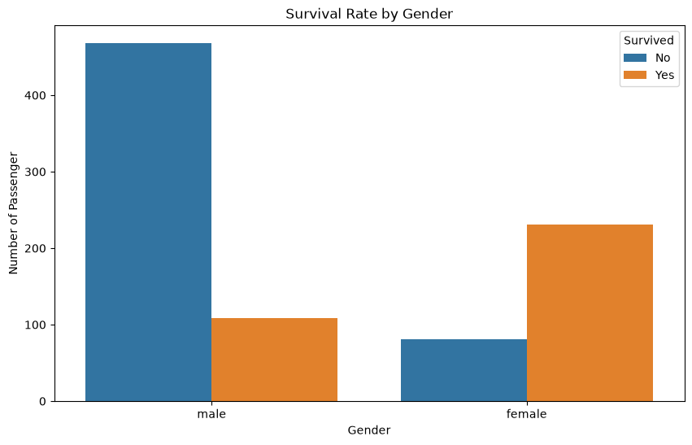
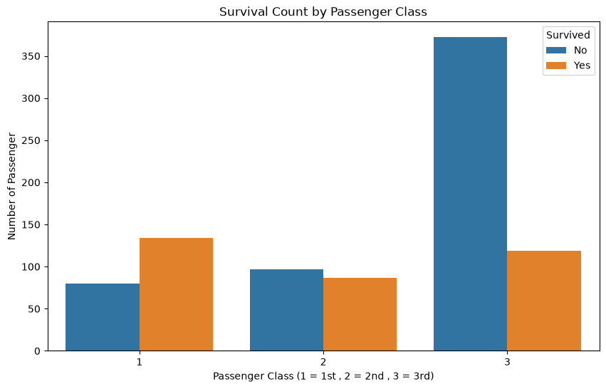
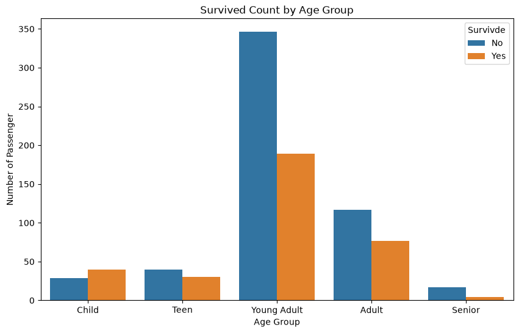
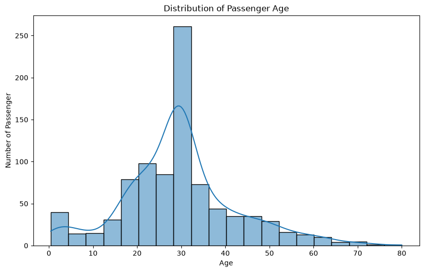

# Titanic Survival Analysis

An exploratory data analysis (EDA) project in Python investigating passenger demographics, socio-economic factors, and key determinants of survival on the RMS Titanic.



---

## Table of Contents

- [Overview](#overview)
- [Dataset Schema & Structure](#dataset-schema--structure)
- [Tech Stack & Requirements](#tech-stack--requirements)
- [Getting Started](#getting-started)
- [Features & Operations Covered](#features--operations-covered)
- [Sample Analysis & Real Output](#sample-analysis--real-output)
  - [1. Overall Survival Rate](#1-overall-survival-rate)
  - [2. Survival Analysis by Gender](#2-survival-analysis-by-gender)
  - [3. Survival Analysis by Passenger Class](#3-survival-analysis-by-passenger-class)
  - [4. Survival Analysis by Age Group](#4-survival-analysis-by-age-group)
  - [5. Passenger Age Distribution](#5-passenger-age-distribution)
  - [6. Multivariate Analysis: Class and Gender Interaction](#6-multivariate-analysis-class-and-gender-interaction)
  - [7. Summary of Findings](#7-summary-of-findings)
- [Assumptions Made](#assumptions-made)
- [Project Structure](#project-structure)
- [Author](#author)
- [License](#license)

---

## Overview

The **Titanic Survival Analysis** project performs an exploratory data analysis (EDA) on the Titanic passenger dataset (`train.csv`). The primary objective is to clean the raw passenger data, handle missing values, engineer demographic cohorts (`AgeGroup`), and analyze the relationship between passenger attributes (such as gender, socio-economic class, and age) and their likelihood of survival during the maritime disaster.

---

## Dataset Schema & Structure

The dataset contains initial records for 891 passengers across 12 features.

### Original Feature Schema

| Column Name | Data Type | Null Count (Raw) | Description | Preprocessing Action |
| :--- | :--- | :--- | :--- | :--- |
| `PassengerId` | `int64` | 0 | Unique identifier for each passenger | Kept as index/identifier |
| `Survived` | `int64` | 0 | Target variable: Survival indicator (`0 = No`, `1 = Yes`) | Target variable |
| `Pclass` | `int64` | 0 | Ticket class / Socio-economic status (`1 = 1st`, `2 = 2nd`, `3 = 3rd`) | Kept as categorical factor |
| `Name` | `object` | 0 | Full passenger name and title | Kept intact |
| `Sex` | `object` | 0 | Passenger gender (`male`, `female`) | Primary demographic feature |
| `Age` | `float64` | 177 | Passenger age in years | Missing values imputed with mean (`~29.70`) |
| `SibSp` | `int64` | 0 | Number of siblings / spouses aboard | Kept intact |
| `Parch` | `int64` | 0 | Number of parents / children aboard | Kept intact |
| `Ticket` | `object` | 0 | Ticket number string | Kept intact |
| `Fare` | `float64` | 0 | Passenger fare amount paid | Kept intact |
| `Cabin` | `object` | 687 | Cabin allocation number | Dropped due to >77% missing records |
| `Embarked` | `object` | 2 | Port of embarkation (`C = Cherbourg`, `Q = Queenstown`, `S = Southampton`) | 2 missing rows dropped |

### Engineered Features

| Feature Name | Derived From | Bins / Categories | Description |
| :--- | :--- | :--- | :--- |
| `AgeGroup` | `Age` | `[0, 12]`: **Child**<br>`(12, 18]`: **Teen**<br>`(18, 35]`: **Young Adult**<br>`(35, 60]`: **Adult**<br>`(60, 80]`: **Senior** | Categorical age binning created via `pd.cut()` to assess survival across life stages. |

---

## Tech Stack & Requirements

- **Programming Language**: Python 3.9+
- **Environment**: Jupyter Notebook / JupyterLab
- **Core Libraries**:
  - `pandas` - Data manipulation, cleaning, aggregation, and binning
  - `numpy` - Numerical computations
  - `matplotlib` - Figure formatting, titles, and layout configuration
  - `seaborn` - Statistical data visualizations (count plots, bar plots, distribution histograms with KDE)

---

## Getting Started

### 1. Clone the Repository
```bash
git clone https://github.com/rudhiyansh/titanic-survival-analysis.git
cd titanic-survival-analysis
```

### 2. Set Up Virtual Environment (Optional but Recommended)
```bash
python -m venv venv
# On Windows:
venv\Scripts\activate
# On macOS/Linux:
source venv/bin/activate
```

### 3. Install Dependencies
```bash
pip install pandas numpy matplotlib seaborn notebook
```

### 4. Ensure Dataset Location
Place `train.csv` in the root project directory (or adjust the path in Cell 1 of the notebook):
```python
df = pd.read_csv("train.csv")
```

### 5. Launch Jupyter Notebook
```bash
jupyter notebook "titanic survival analysis (1).ipynb"
```
Run all cells sequentially from top to bottom (`Cell` -> `Run All`).

---

## Features & Operations Covered

| Task / Operation | Description | Implementation in Notebook |
| :--- | :--- | :--- |
| **Data Ingestion & Inspection** | Load CSV file and inspect schema, data types, dimensions, and statistical summaries. | Cells 0–7 (`pd.read_csv`, `df.info()`, `df.shape`, `df.columns.tolist()`, `df.describe()`) |
| **Feature Removal** | Drop high-cardinality/sparse `Cabin` column with excessive nulls. | Cell 9 (`df.drop(columns="Cabin", inplace=True)`) |
| **Null Value Audit** | Verify missing values across all columns. | Cells 11, 14, 17 (`df.isnull().sum()`) |
| **Imputation** | Fill 177 missing `Age` values using the column arithmetic mean. | Cell 13 (`df["Age"].fillna(df["Age"].mean())`) |
| **Row-Level Cleaning** | Remove records with missing `Embarked` values (2 rows removed; remaining `N = 889`). | Cell 16 (`df.dropna(subset="Embarked")`) |
| **Duplicate Verification** | Verify uniqueness across records. | Cell 19 (`df.duplicated().sum()`) |
| **Overall Survival Rate** | Compute aggregate percentage of passengers surviving the disaster. | Cells 23–24 (`survival_rate = df["Survived"].mean() * 100`) |
| **Gender-Based Analysis** | Calculate survival rate by gender and visualize survivor/non-survivor counts. | Cell 26 (`df.groupby("Sex")["Survived"].mean() * 100`, `sns.countplot`) |
| **Class-Based Analysis** | Compute survival percentages across 1st, 2nd, and 3rd passenger classes and visualize. | Cell 28 (`df.groupby("Pclass")["Survived"].mean() * 100`, `sns.countplot`) |
| **Demographic Binning** | Construct categorical `AgeGroup` variable using 5 defined intervals. | Cell 30 (`pd.cut()`) |
| **Age-Group Survival Analysis** | Calculate survival rate across age brackets and generate count visualization. | Cell 30 (`df.groupby("AgeGroup")["Survived"].mean() * 100`, `sns.countplot`) |
| **Age Distribution Plotting** | Visualize overall passenger age frequency using a 20-bin histogram with KDE overlay. | Cell 32 (`sns.histplot(x=df["Age"], bins=20, kde=True)`) |
| **Multivariate Class × Sex Analysis** | Bar plot comparing survival probability by passenger class partitioned by gender. | Cell 34 (`sns.barplot(data=df, x="Pclass", y="Survived", hue="Sex")`) |
| **Summary & Findings** | Print final analytical conclusions in the terminal/cell output. | Cell 36 (`print()`) |

---

## Sample Analysis & Real Output

### 1. Overall Survival Rate

```python
survival_rate = df["Survived"].mean() * 100
print(f"Overall survival rate : {survival_rate:.2f}")
```

**Output:**
```text
Overall survival rate : 38.25
```

---

### 2. Survival Analysis by Gender

```python
print("Survival Rate by Gender")
print(df.groupby("Sex")["Survived"].mean() * 100)
```

**Output:**
```text
Survival Rate by Gender
Sex
female    74.038462
male      18.890815
Name: Survived, dtype: float64
```



---

### 3. Survival Analysis by Passenger Class

```python
print("Survived Rate by Passenger Class")
print(df.groupby("Pclass")["Survived"].mean() * 100)
```

**Output:**
```text
Survived Rate by Passenger Class
Pclass
1    62.616822
2    47.282609
3    24.236253
Name: Survived, dtype: float64
```



---

### 4. Survival Analysis by Age Group

```python
bins = [0, 12, 18, 35, 60, 80]
labels = ["Child", "Teen", "Young Adult", "Adult", "Senior"]
df["AgeGroup"] = pd.cut(df["Age"], bins=bins, labels=labels)

print("Survival Rate by Age Group")
print(df.groupby("AgeGroup", observed=True)["Survived"].mean() * 100)
```

**Output:**
```text
Survival Rate by Age Group
AgeGroup
Child          57.971014
Teen           42.857143
Young Adult    35.327103
Adult          39.690722
Senior         19.047619
Name: Survived, dtype: float64
```



---

### 5. Passenger Age Distribution

```python
plt.figure(figsize=(10, 6))
sns.histplot(x=df["Age"], bins=20, kde=True)
plt.title("Distribution of Passenger Age")
plt.xlabel("Age")
plt.ylabel("Number of Passenger")
plt.show()
```



---

### 6. Multivariate Analysis: Class and Gender Interaction

```python
plt.figure(figsize=(10, 6))
sns.barplot(data=df, x="Pclass", y="Survived", hue="Sex")
plt.title("Survival Rate by Class and Gender")
plt.xlabel("Passenger Class")
plt.ylabel("Survival Rate")
plt.show()
```


---

### 7. Summary of Findings

```text
         ----- Summary of Findings -----          

1. Females had a much higher survival rate by males.
2. 1st Class passenger survived more than 2nd and 3rd class.
3. Children has a relatively better survival rate than adults.

This matches the 'woman and children first' policy followed during disaster.
```

---

## Assumptions Made

- **Age Imputation**: Missing passenger ages (177 instances) were imputed using the global arithmetic mean (`~29.70` years) rather than group-specific (e.g. title/class-based) medians.
- **Cabin Exclusion**: The `Cabin` attribute was dropped entirely because over 77% of rows lacked records (687 missing out of 891).
- **Missing Embarkation Handling**: The 2 passenger records with missing `Embarked` values were dropped via listwise deletion, leaving 889 records for analysis.
- **Age Interval Partitioning**: Age categories were defined using right-inclusive intervals: Child `(0, 12]`, Teen `(12, 18]`, Young Adult `(18, 35]`, Adult `(35, 60]`, and Senior `(60, 80]`.

---

## Project Structure

```text
titanic-survival-analysis/
├── README.md
├── titanic survival analysis (1).ipynb
├── train.csv
└── screenshots/
    ├── passenger_age_distribution.png
    ├── survival_count_by_age_group.png
    ├── survival_count_by_class.png
    ├── survival_rate_by_class_and_gender.png
    └── survival_rate_by_gender.png
```

---

## Author

- **GitHub**: [@rudhiyansh](https://github.com/rudhiyansh)

---

## License

This project is open-source and available under the [MIT License](LICENSE).
